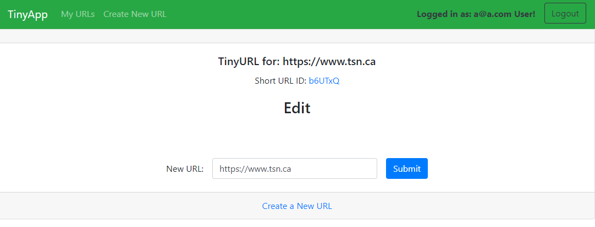

# TinyApp Project

TinyApp is a full stack web application built with Node and Express that allows users to shorten long URLs (à la bit.ly).

## Final Product
Some screen shots of the TinnyApp



## Dependencies

- Node.js
- Express
- EJS
- bcryptjs
- cookie-session

## Getting Started

1. Install all dependencies using the following command:
    ```bash
    npm install
    ```

2. Run the development web server using the following command:
    ```bash
    node express_server.js
    ```

## Goal

This four-day project aims to build a web app using Node. The app allows users to shorten long URLs, similar to TinyURL.com and bit.ly.

## Project Outcome

The project results in a simple multipage app:

- With authentication protection.
- Reacting appropriately to the user's logged-in state.
- Permitting the user to create, read, update, and delete (CRUD) a simple entity (e.g., blog posts, URL shortener).

## User Stories

- As an avid twitter poster, I want to shorten links to fit more non-link text in my tweets.
- As a twitter reader, I want to visit sites via shortened links to read interesting content.
- (Stretch) As an avid twitter poster, I want to see how many times my subscribers visit my links to learn what content they like.
